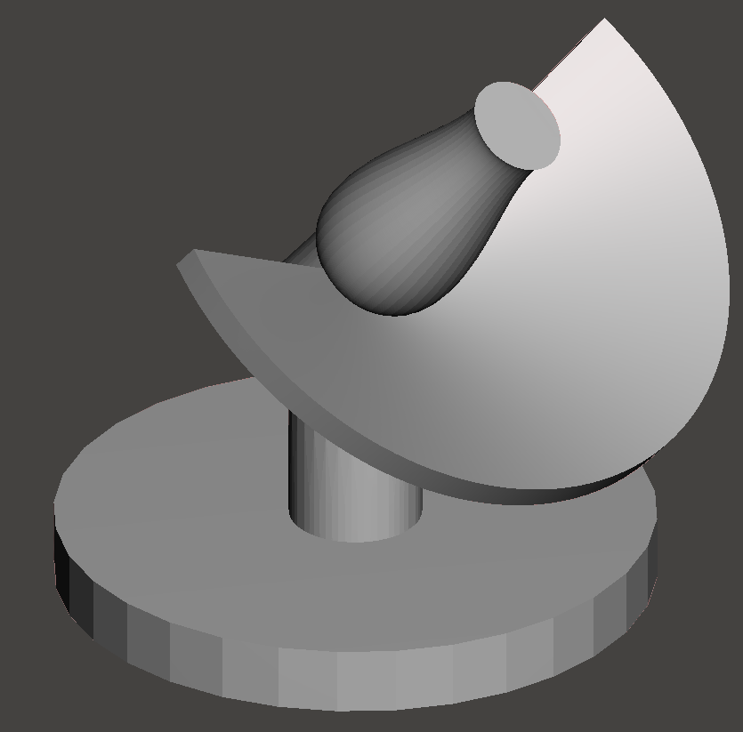

# parametric-sundial

A web generator for a 3D-printable **Bernhardt precision sundial** (equatorial ring dial with
a *Bernhardtsche Walze*, the shaped roller gnomon that builds the equation of time into the
shadow so the dial reads mean zone time to the minute). Enter a location, get four STL files:
the organic crescent dial, the two rollers (one per half year) and a stand tilted to your latitude.



## Run it

```bash
pip install -r app/requirements.txt
cd app && uvicorn sundialweb.api:app --reload
# open http://127.0.0.1:8000
```

or with Docker:

```bash
docker build -t sundial . && docker run -p 8000:8000 sundial
```

Command line, no server:

```bash
cd app && python -m sundialweb.cli --lat 48.7758 --lon 9.1829 --utc 1 --label "CET  UTC+1" -o out/
```

## Host it for free

The app is a single container (Dockerfile in the repo, honours `PORT`) and needs about 300 MB
of RAM and a few seconds of CPU per generation, so the free tiers are enough:

* **Hugging Face Spaces** (simplest, no card): create a Space with the *Docker* SDK, push this
  repo to it, and add `app_port: 8000` to the Space's README front matter. Spaces sleep after
  48 h without visitors and wake on the next request.
* **Render**: fork the repo, then *New > Blueprint* and pick `render.yaml`. The free web service
  sleeps after 15 min idle and takes about a minute to wake.
* **Google Cloud Run**: `gcloud run deploy --source .` from the repo root; scales to zero and the
  monthly free tier covers hobby traffic.

Generated results are cached in `SUNDIAL_CACHE` (default: the system temp dir); on these hosts
the cache is wiped on restart, which is fine.

## What the site does

1. Pick a location on the map or type coordinates. The standard-time UTC offset of the local
   zone is looked up automatically (no daylight-saving shift: the dial shows standard time and
   carries an engraved note to add one hour in summer).
2. Choose the reading-circle diameter (default 150 mm; the shape is scale-free, only the 8 mm
   plugs and the minimum roller neck stay fixed). The hour range is derived from the earliest
   sunrise and latest sunset at the location.
3. Generate. A Three.js preview shows the assembled dial with a real sun position for any date and
   time of the year, with shadows, so you can watch the leading edge of the roller shadow land on
   the red expected-reading dot. Download the parts individually or as a zip with a README.

## How the geometry is computed (`app/sundialweb`)

* `solar.py`: NOAA/Meeus solar position (declination, equation of time, hour angle) and the
  *dial frame* (z = elevated celestial pole, y = shadow direction at true noon). Works in both
  hemispheres.
* `design.py`: for every 6 hours between the solstices the ray from the correct mean-time mark
  towards the sun is intersected with the polar axis: its distance gives the roller radius, its
  height the nodus position. The scale is rotated so the leading shadow edge is always ahead of
  the shadow centre (longitude offset + max equation of time + minimum neck radius). The roller
  is the envelope of all ray hyperboloids; near the solstices the hyperboloids overlap and no
  surface of revolution can be tangent to every ray, so the residual error is balanced between
  neighbouring days (about ±2.5 min for three weeks in December, ±1 min in June, otherwise
  below 0.5 min). The reading error of every day is reported.
* `meshing.py`: the crescent dial is a height field whose shape is derived from the sun rays
  themselves: under the winter hours it is a dish so the low winter sun lights the scale from
  above; where the low morning/evening sun has to pass the opposite wing the plate twists into a
  thin blade in the scale plane; where neither works the plate is cut away (the crescent's inner
  edge). Ticks and numerals are engraved with manifold booleans. Rollers are surfaces of revolution
  with an identification groove (I = one, II = two) and a threaded pin that screws into the hub
  (one rounded helical ridge, 2.5 mm pitch, 0.3 mm radial clearance, so it prints and fits without
  calibration; the collar seats on the hub and sets the height). The stand has a keyed pin so the
  dial can only sit in the right orientation. Its base is the place's own noon analemma (the
  sun's hour angle at twelve o'clock against its distance from the zenith), fattened into a flat
  plate with the months engraved along the curve; the stem stands inside the smaller loop of the
  eight on both hemispheres.
  The analemma is scaled so the foot fits its loop and, if needed, until the assembled dial can be
  tilted 22° in any direction before it tips. The API reports the achieved tip angle under
  `stability`.
* `api.py`: FastAPI, serves the frontend in `web/` and `/api/generate`, `/api/timezone`, `/api/sun`.

Tests (`app/tests`) cast real rays against the generated roller and dial meshes to verify that the
shadow edge lands on the right minute and that the dial body does not shadow its own scale.

## Printing

* `dial.stl` scale side up, tree supports under the wings and hub; 0.15–0.2 mm layers.
* `roller_1.stl`, `roller_2.stl` pin down with a brim.
* `stand.stl` plate down; the stem's bend needs no supports above about 25° latitude, tree supports under it otherwise.

Level the plate, point its long axis to true north (south on the southern hemisphere), drop the dial on
the keyed pin, screw in the roller for the current half year until its collar seats, and read at
the leading shadow edge.

## References

* Wikipedia: [Bernhardtsche Walze](https://de.wikipedia.org/wiki/Bernhardtsche_Walze)
* G. Glaeser, W. Hofmann: *Über minutengenaue Sonnenuhren für die Mittlere Zeit*,
  Informationsblätter der Geometrie 2/2004.
* The original Python/Grasshopper experiments are kept in `sundial/`, `examples/` and `grasshopper/`.
