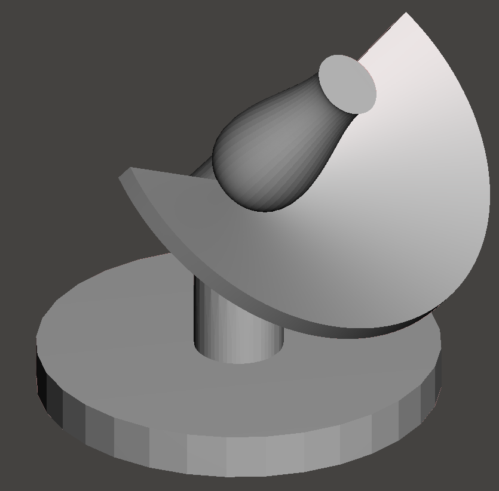

# parametric-sundial

A web generator for a 3D-printable **Bernhardt precision sundial** (equatorial ring dial with
a *Bernhardtsche Walze*, the shaped roller gnomon that builds the equation of time into the
shadow so the dial reads mean zone time to the minute). Enter a location, get four STL files:
the organic crescent dial, the two rollers (one per half year) and a stand tilted to your latitude.



## Run it

```bash
pip install -r app/requirements.txt
cd app && uvicorn sundialweb.api:app --reload
# open http://127.0.0.1:8000
```

or with Docker:

```bash
docker build -t sundial . && docker run -p 8000:8000 sundial
```

Command line, no server:

```bash
cd app && python -m sundialweb.cli --lat 48.7758 --lon 9.1829 --utc 1 --label "CET  UTC+1" -o out/
```

## Host it for free

The app is a single container (Dockerfile in the repo, honours `PORT`) and needs about 300 MB
of RAM and a few seconds of CPU per generation, so the free tiers are enough:

* **Hugging Face Spaces** (simplest, no card): create a Space with the *Docker* SDK, push this
  repo to it, and add `app_port: 8000` to the Space's README front matter. Spaces sleep after
  48 h without visitors and wake on the next request.
* **Render**: fork the repo, then *New > Blueprint* and pick `render.yaml`. The free web service
  sleeps after 15 min idle and takes about a minute to wake.
* **Google Cloud Run**: `gcloud run deploy --source .` from the repo root; scales to zero and the
  monthly free tier covers hobby traffic.

Generated results are cached in `SUNDIAL_CACHE` (default: the system temp dir); on these hosts
the cache is wiped on restart, which is fine.

## What the site does

The page is a four-beat flow, mobile first:

1. **Where am I.** The opening shows the last dial anyone made, with the sun looping through
   its day, beside a place card: use my location, search a town (or type coordinates), adjust
   on a map. The card shows the tilt, the engraved hour range and whether the zone keeps summer
   time before anything is built. One button: *Make my sundial*.
2. **Making it.** The facts of the dial appear at once (longest day, hours, roller waist, tilt),
   the analemma draws itself, and six named stages tick off as the server builds (design, dial,
   roller I, roller II, base, packing) with an estimate from the last builds. A repeat request
   comes from the cache. A closed tab can be reopened within ten minutes and picks the job up.
3. **Your dial today.** The viewer opens at the place's current standard time with the right
   roller fitted, or, when the sun is down or outside the engraved hours, at tomorrow's first
   light on the dial. The page's own shadows follow the sun of the moment shown.
4. **Take it home.** One ZIP button (size and bed hint), a *Buy us a coffee* button beside it
   that explains the server cost and never gates anything, part previews on a build plate with
   size, volume, weight and support hints, print notes, setup steps and a share link.

Settings (diameter, year, hour range, roller neck, labels, manual coordinates) and the full
numbers live one tap away in side sheets. A quiet *Dial map* in the top bar shows where dials
have been made (one entry per session per minute, coordinates to a tenth of a degree). Seven
languages, right-to-left included; the stories behind the design are in `docs/web-stories.md`.

### API

| Route | What it does |
|---|---|
| `GET /api/timezone?lat&lon` | standard offset, zone name, summer-time label |
| `GET /api/design?lat&lon&utc_offset_h&year&scale_radius…` | the dial's facts without meshing (a few seconds, cached) |
| `POST /api/generate` | `{cached: true, info}` at once, or `{job, estimates, stages}`; header `X-Sundial-Session` for the map |
| `GET /api/jobs/{id}` and `/events` | job status; server-sent events with the current stage |
| `GET /api/files/{key}/{name}` | `dial.stl`, `roller_1.stl`, `roller_2.stl`, `stand.stl`, `sundial.zip`, `viewer.glb` (decimated, for the browser) |
| `GET /api/latest` | the last dial made, for the opening picture |
| `GET /api/history` | where dials have been made, for the map |
| `GET /api/notes?lang` | print notes and setup steps from the site's strings (also used in the zip README) |

One worker thread builds dials in order. `SUNDIAL_MAX_QUEUE` (default 12) caps the queue,
`SUNDIAL_MAX_PER_CLIENT` (default 2) the pending dials per address. A fresh server builds a
Stuttgart dial at startup so the opening is never empty (`SUNDIAL_NO_WARMUP=1` disables it).
Every creation is logged to `creations.jsonl` in the cache dir with hashed session and client.

## How the geometry is computed (`app/sundialweb`)

* `solar.py`: NOAA/Meeus solar position (declination, equation of time, hour angle) and the
  *dial frame* (z = elevated celestial pole, y = shadow direction at true noon). Works in both
  hemispheres.
* `design.py`: for every 6 hours between the solstices the ray from the correct mean-time mark
  towards the sun is intersected with the polar axis: its distance gives the roller radius, its
  height the nodus position. The scale is rotated so the leading shadow edge is always ahead of
  the shadow centre (longitude offset + max equation of time + minimum neck radius). The roller
  is the envelope of all ray hyperboloids; near the solstices the hyperboloids overlap and no
  surface of revolution can be tangent to every ray, so the residual error is balanced between
  neighbouring days (about ±2.5 min for three weeks in December, ±1 min in June, otherwise
  below 0.5 min). The reading error of every day is reported.
* `meshing.py`: the crescent dial is a height field whose shape is derived from the sun rays
  themselves: under the winter hours it is a dish so the low winter sun lights the scale from
  above; where the low morning/evening sun has to pass the opposite wing the plate twists into a
  thin blade in the scale plane; where neither works the plate is cut away (the crescent's inner
  edge). Ticks and numerals are engraved with manifold booleans. Rollers are surfaces of revolution
  with an identification groove (I = one, II = two) and a threaded pin that screws into the hub
  (one rounded helical ridge, 2.5 mm pitch, 0.3 mm radial clearance, so it prints and fits without
  calibration; the collar seats on the hub and sets the height). The stand has a keyed pin so the
  dial can only sit in the right orientation. Its base is the place's own noon analemma (the
  sun's hour angle at twelve o'clock against its distance from the zenith), fattened into a flat
  plate with the months engraved along the curve. The figure is the shadow trace of a vertical
  gnomon and lies on the pole side of its foot, so the stem stands in the loop on the reader's side
  (the small June loop north of the tropics; in the south the December sun passes nearly overhead
  and the big loop wraps around the foot) and the other loop lies under the dial.
  The analemma is scaled so the foot fits its loop and, if needed, until the assembled dial can be
  tilted 22° in any direction before it tips. The API reports the achieved tip angle under
  `stability`.
* `api.py`: FastAPI, serves the frontend in `web/` and `/api/generate`, `/api/timezone`, `/api/sun`.

Tests (`app/tests`) cast real rays against the generated roller and dial meshes to verify that the
shadow edge lands on the right minute and that the dial body does not shadow its own scale.

## Printing

* `dial.stl` scale side up, tree supports under the wings and hub; 0.15–0.2 mm layers.
* `roller_1.stl`, `roller_2.stl` pin down, with supports under the bell.
* `stand.stl` plate down; the stem's bend needs no supports above about 25° latitude, tree supports under it otherwise.

Level the plate, point its long axis to true north (south on the southern hemisphere), drop the dial on
the keyed pin, screw in the roller for the current half year until its bell seats, and read at
the leading shadow edge. The dial is read from the pole side, where its face tilts towards you;
the numerals have their tops towards the hub and the hours run from right to left.

## References

* Wikipedia: [Bernhardtsche Walze](https://de.wikipedia.org/wiki/Bernhardtsche_Walze)
* G. Glaeser, W. Hofmann: *Über minutengenaue Sonnenuhren für die Mittlere Zeit*,
  Informationsblätter der Geometrie 2/2004.
* The original Python/Grasshopper experiments are kept in `sundial/`, `examples/` and `grasshopper/`.
